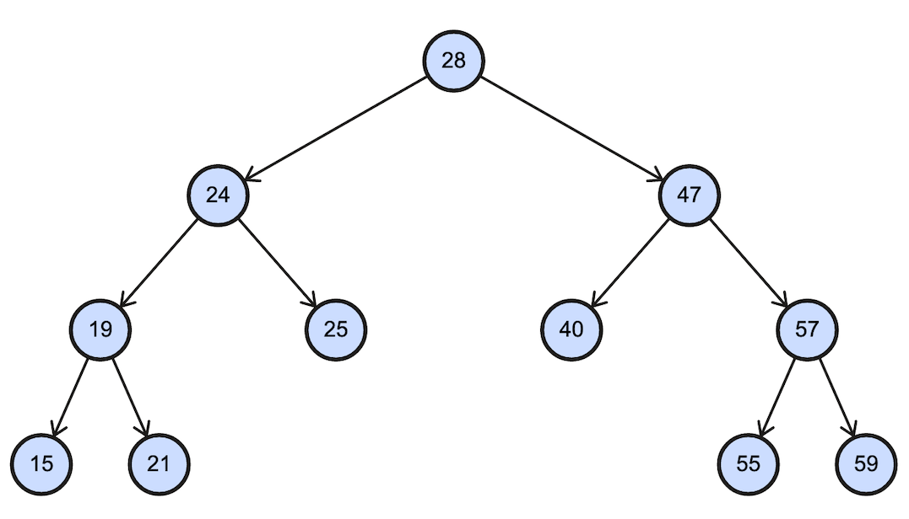

## Binary Tree Traversal
- [Swift](https://github.com/lukabratos/algorithms/blob/master/binary_tree_traversal.swift)
- [Python](https://github.com/lukabratos/algorithms/blob/master/binary_tree_traversal.py)

## Counting Sort

- [Swift](https://github.com/lukabratos/algorithms/blob/master/counting_sort.swift)
